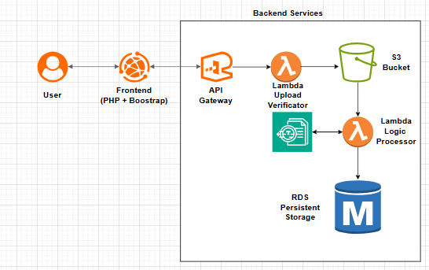

# AWS Invoice Processing Module
A reference implementation of a small AWS-based invoice ingestion and accounting workflow.

This project demonstrates how to build a document-driven back-office module where users upload vendor invoice PDFs, the system extracts structured data, validates key fields, creates or matches vendors, stores invoices in a relational database, and generates double-entry accounting records.

## Overview
Many small finance and accounting teams still process invoices manually. This project shows how a lightweight AWS-based solution can simplify the workflow while keeping the architecture clean and practical for low-volume operations.

The design is intentionally optimized for a small team and low daily volume rather than large-scale enterprise throughput.

## Main Features
- Upload invoice PDF from a web interface
- Store original document in Amazon S3
- Extract invoice data using Amazon Textract
- Validate extracted values such as vendor, invoice number, subtotal, tax, and total
- Match existing vendor or create a new vendor record
- Store invoice in MySQL
- Generate double-entry accounting records
- Return success or validation errors to the user

## Architecture Summary
- Frontend: PHP + Bootstrap
- File storage: Amazon S3
- Extraction: Amazon Textract
- Backend processing: PHP service layer
- Database: MySQL
- Optional future enhancement: AI-assisted account classification

## Architecture Diagram

## Design Decisions

### Why a simple architecture?
This solution is intentionally designed for low-volume operations (1–2 invoices per day).
Instead of introducing unnecessary distributed components, the system keeps a simple and maintainable flow.

### Why Amazon Textract?
Textract provides structured extraction specifically for financial documents such as invoices,
making it more reliable than generic OCR solutions.

### Why no Step Functions or queues?
For low throughput systems, synchronous processing reduces complexity, cost, and operational overhead.

### Why double-entry accounting?
The system generates balanced journal entries to ensure financial integrity and traceability.

## Typical Workflow
1. User uploads a PDF invoice
2. The file is stored in Amazon S3
3. The backend sends the document to Amazon Textract
4. Extracted fields are parsed and validated
5. Vendor is matched or created
6. Invoice is stored in MySQL
7. Journal entries are generated:
   - Debit: Expense Account
   - Credit: Accounts Payable or Cash
8. Result is returned to the user

## Why this project exists
This project was created to demonstrate practical cloud architecture and application design for small business financial workflows using AWS managed services.

## Current Scope
This repository focuses on:
- architecture
- backend flow
- schema design
- validation logic
- accounting integration patterns

This repository does not include:
- real production credentials
- proprietary business logic
- private customer or vendor data
- internal company details

## Roadmap
- Add sample UI screenshots
- Add infrastructure-as-code templates
- Add confidence scoring for extraction
- Add manual review workflow
- Add optional AI-based chart-of-accounts classification

## Disclaimer
This is a generic reference implementation intended for educational and portfolio purposes.
